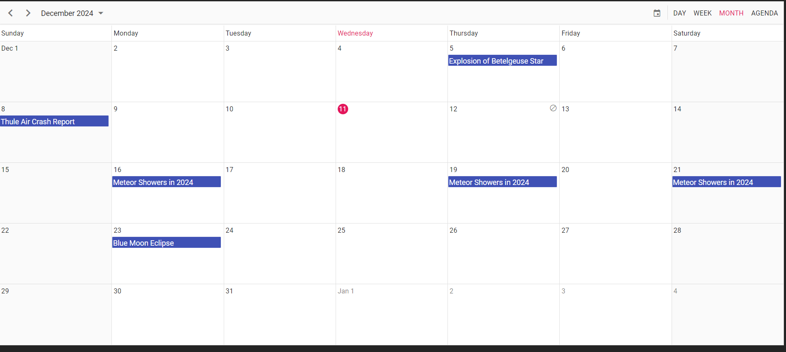
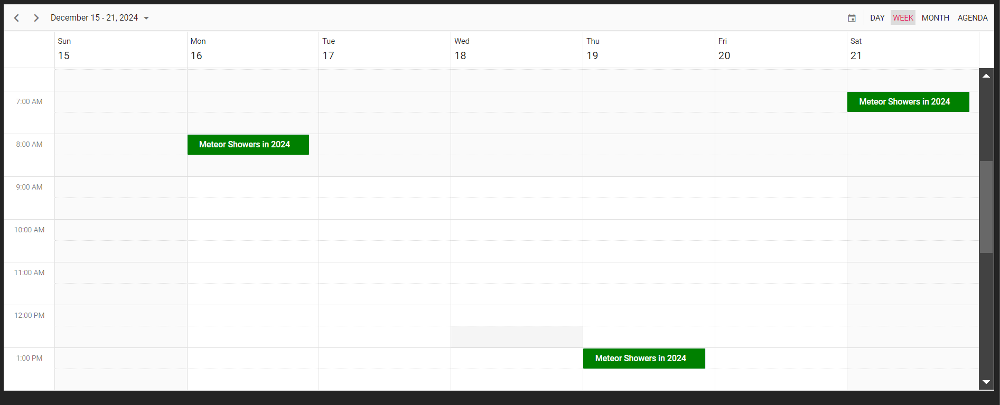
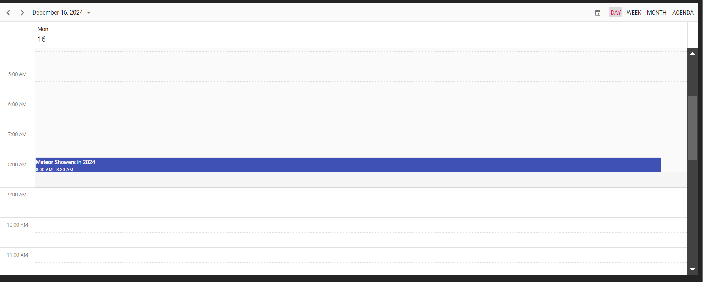
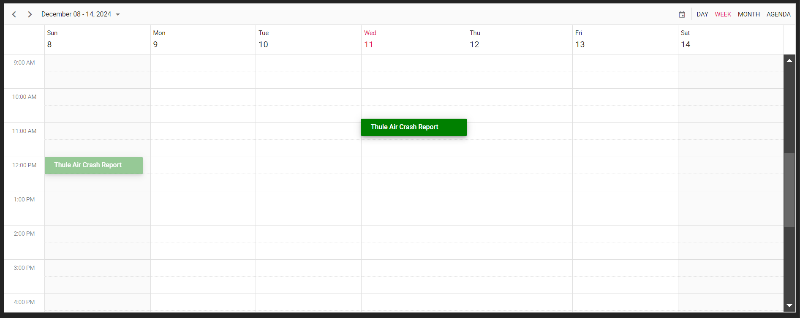

<h1 align="center">Dynamic Event Calendar Application</h1>

  The Dynamic Event Calendar Application is a robust and user-friendly event management platform. Built with modern technologies, it offers seamless calendar functionality and intuitive event management for personal and professional use.

<h2 id="features">Features</h2>

<ul>
  <li>
    <h4 id="calendar-view">Calendar View: A visually appealing calendar grid with monthly, weekly, daily, and agenda views.</h4>
  </li>
  <li>
    <h4 id="event-management">Event Management: Add, edit, delete, and reschedule events easily.</h4>
  </li>
  <li>
    <h4 id="drag-and-drop">Drag and Drop: Allows users to drag and drop events for easy rescheduling.</h4>
  </li>
  <li>
    <h4 id="custom-event-templates">Custom Event Templates: Display events with unique templates for Week and Month views.</h4>
  </li>
</ul>

<h2 id="start-the-app">Start the App</h2>

Follow these steps to run the application locally:

<pre>
<code>
npm install
npm start
</code>
</pre>

<h2 id="deployment">Deployment</h2>

The application is deployed and available online. Visit the live version here:

  <a href="https://event-calendar-2-6lc5.onrender.com/">Live Demo</a>

<h2 id="technologies-used">Technologies Used</h2>

<ul>
  <li>React.js</li>
  <li>Syncfusion React Schedule</li>
  <li>CSS for modern UI design</li>
</ul>

<h2 id="screenshots">Screenshots</h2>

Here are some screenshots of the application:

